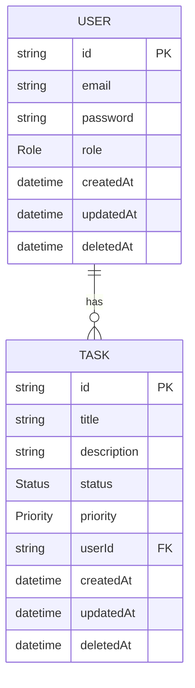
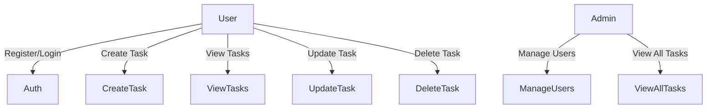
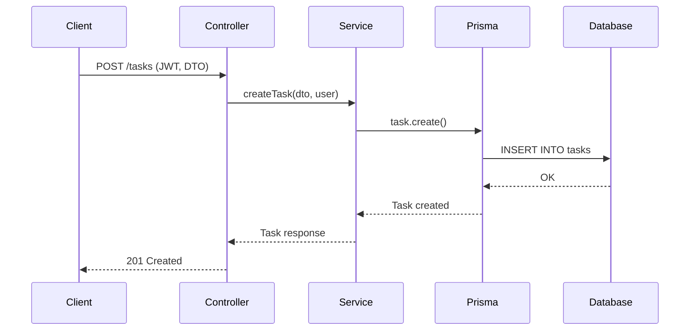

## Diagrams
This document contains the UML diagrams and the Entity-Relationship Diagram (ERD) representing the system's data model and interactions.

# Entity-Relationship Diagram (ERD)
The database is designed using PostgreSQL and modeled via Prisma ORM.

# 📌 Entities

| Entity   | Description                                |
| -------- | ------------------------------------------ |
| User     | Represents an application user             |
| Task     | Can have multiple tasks (1:N relationship) |

# Relationships
* A User can have many Tasks
* A Task belongs to one User
* Cascade delete ensures that when a user is deleted,
* all related tasks are removed

# ERD Diagram (Mermaid)

> # 🧠 Notes
> * Soft delete is implemented using deletedAt
> * Enums are used to enforce data consistency:
>   * Role: USER, ADMIN
>   * Status: PENDING, IN_PROGRESS, DONE
>   * Priority: LOW, MEDIUM, HIGH

# UML - Use Case Diagram
This diagram shows how different actors interact with the system.

# UML - Sequence Diagram (Create Task)
This diagram represents the flow of creating a task.

# Design Decisions
* Prisma ORM → Type-safe queries and better DX
* Soft Deletes → Data is not permanently removed
* Enums → Prevent invalid states
* Cascade Deletes → Maintain referential integrity
* UUIDs → Safer and scalable IDs

# 🚀 Why This Matters
These diagrams help:
* Understand the system quickly
* Communicate architecture to other developers
* Improve maintainability and onboarding
* Showcase professional-level documentation in your portfolio
